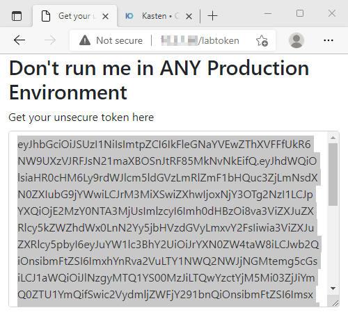

# labtoken

Show the service account token in a web gui for lab envs

This is not something you want to run in any environment. You are basically showing the password in a GUI :)

Latest dockerhub : tdewin/labtoken:latest

Sample K8s config for K10 (injects k10-k10 SA, works in kasten-io namespace) : https://raw.githubusercontent.com/tdewin/labtoken/main/deploymeinlabonly.yaml

This assumes traefik as ingress, modify as you please

